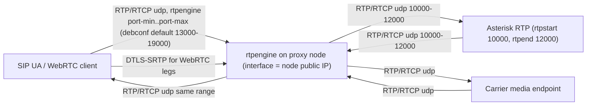

# IvozProvider AWS migration plan

Status: **proposal / design document only**. Nothing in this document has been implemented.
Every "code/config change" column in the tables below describes **future work**; no `debian/`,
`profiles/`, `kamailio/`, `asterisk/`, `microservices/`, `schema/`, `tests/`, `Jenkinsfile` or
`docker-compose.yml` file is modified by the commit that adds this file.

All statements about current behaviour are taken from this repository at the commit that adds
this document. Where the repository does **not** contain the relevant file (e.g. the shipped
`rtpengine.conf`), that is called out explicitly instead of guessed.

Contents:

1. [Current state](#1-current-state)
2. [Host assumptions vs AWS equivalents](#2-host-assumptions-vs-aws-equivalents)
3. [Target design per plane](#3-target-design-per-plane)
4. [The autoscaling problem](#4-the-autoscaling-problem)
5. [Migration waves](#5-migration-waves)
6. [IP continuity per brand](#6-ip-continuity-per-brand)
7. [Acceptance gates](#7-acceptance-gates)
8. [Open questions for the platform team](#8-open-questions-for-the-platform-team)

---

## 1. Current state

The platform is a set of Debian *profiles* (`profiles/`, `debian/ivozprovider-profile-*`) glued
together by a private `.local` DNS zone served by BIND from the data profile
(`profiles/data/etc/bind/db.ivozprovider.local`) and by `/etc/resolv.conf`, which
`debian/ivozprovider-profile-common.preinst` writes and then makes immutable with `chattr +i`.

Service discovery is therefore *entirely* name-based on the eight records
`users`, `trunks`, `jobs`, `data`, `cache`, `storage`, `logs`, `hep` under `ivozprovider.local`.

### 1.1 Signalling and control plane

```mermaid
graph TD
  subgraph Endpoints
    UA["SIP UAs / softphones"]
    WRTC["WebRTC clients"]
    CARRIER["Carriers / ITSPs"]
    ADMIN["Operators and API clients"]
  end

  subgraph Proxy["Proxy profile (ivozprovider-profile-proxy)"]
    KU["kamailio@users (proxyusers)"]
    KT["kamailio@trunks (proxytrunks)"]
    RTPE["rtpengine"]
    CGR["CGRateS"]
  end

  subgraph AS["AS profile (ivozprovider-profile-as)"]
    AST["Asterisk 20 (PJSIP)"]
    AGI["FastAGI (PHP)"]
  end

  subgraph Portal["Portal profile (ivozprovider-profile-portal)"]
    APACHE["Apache: portals + REST API"]
    RT["realtime microservice"]
    SUP["supervisor daemons: kamrpc, dialplan, hints, cgrates, invoicer, rates-importer"]
  end

  subgraph Data["Data profile (ivozprovider-profile-data)"]
    DB["MySQL / Percona: ivozprovider"]
    BIND["BIND: ivozprovider.local zone"]
  end

  CACHE["Redis + Sentinel (cache.ivozprovider.local)"]
  STORE["NFS share (storage.ivozprovider.local)"]
  LOGS["rsyslog (logs.ivozprovider.local)"]
  HEP["Homer / HEP capture (hep.ivozprovider.local)"]
  JOBS["jobs.ivozprovider.local: SMTP, click2call"]

  UA -->|"SIP 5060/udp, 5060/tcp"| KU
  UA -->|"SIP TLS 5061/tcp"| KU
  WRTC -->|"WS 10080/tcp, WSS 10081/tcp"| KU
  CARRIER -->|"SIP 5060/udp+tcp, SIPS 5061/tcp"| KT
  ADMIN -->|"HTTP 80, HTTPS 443"| APACHE
  ADMIN -->|"provisioning HTTPS 1443, 2443, 3443"| APACHE

  KU -->|"SIP to trunks: TRUNKS_SIP_PORT 5060 (7060 if collocated)"| KT
  KT -->|"SIP 5060 back to users"| KU
  KU <-->|"DMQ over SIP 5060 (USERS_DMQ_SERVER / TRUNKS_DMQ_SERVER)"| KT
  KU -->|"SIP 6060/udp to Asterisk"| AST
  KT -->|"SIP 6060/udp to Asterisk"| AST
  AST -->|"SIP 6060/udp, contact sip:trunks.ivozprovider.local[:7060]"| KT

  AST -->|"FastAGI 4573/tcp"| AGI
  AST -->|"AMI 5038/tcp"| SUP
  AST -->|"ARI/HTTP 8088/tcp"| SUP
  AST -->|"ODBC MySQL 3306"| DB

  KU -->|"MySQL 3306 (DBURL, kamailio user)"| DB
  KT -->|"MySQL 3306 (DBURL, kamailio user)"| DB
  APACHE -->|"MySQL 3306 (DATABASE_URL)"| DB
  AGI -->|"MySQL 3306"| DB

  KU -->|"Redis Sentinel 26379 (db 1, group mymaster)"| CACHE
  KT -->|"Redis Sentinel 26379 (db 1)"| CACHE
  RT -->|"Redis Sentinel 26379"| CACHE
  APACHE -->|"Redis Sentinel 26379"| CACHE
  CGR -->|"Redis Sentinel 26379 (db 10)"| CACHE

  KT -->|"HTTP 2080 (http_client cgrates)"| CGR
  CGR -->|"rpc_json 2012, rpc_gob 2013"| SUP
  CGR -->|"stor_db MySQL 3306"| DB

  KU -->|"rtpengine ng control 2223/udp"| RTPE
  KT -->|"rtpengine ng control 2223/udp"| RTPE

  APACHE -->|"NFS 2049 recordings, locutions, faxes, invoices"| STORE
  AST -->|"NFS 2049"| STORE
  RT -->|"internal WS 8081 proxied as /wss"| APACHE
  APACHE -->|"SMTP 25"| JOBS
  APACHE -->|"click2call HTTPS 9090"| JOBS

  KU -->|"HEPv3 9060 (siptrace)"| HEP
  KT -->|"HEPv3 9060 (siptrace)"| HEP
  KU -->|"syslog 514"| LOGS
  AST -->|"syslog 514"| LOGS

  KU -->|"DNS 53 for .local"| BIND
  KT -->|"DNS 53 for .local"| BIND
  AST -->|"DNS 53 for .local"| BIND
  APACHE -->|"DNS 53 for .local"| BIND
```



### 1.2 Media plane (deliberately separate from the graph above)



Sources for the values above: `kamailio/users/config/kamailio.cfg` and
`kamailio/trunks/config/kamailio.cfg` (DMQ, `DBURL`, `ndb_redis` sentinel, `rtpengine` module,
`WS_PORT`/`WSS_PORT`/`RPC_PORT`/`XMLRPC_PORT` usage), `profiles/proxy/etc/kamailio/autoconf`
(the port and listener generator), `asterisk/config/pjsip.conf.in` (`bind=0.0.0.0:6060`),
`asterisk/config/rtp.conf` (`rtpstart=10000`, `rtpend=12000`), `asterisk/config/manager.conf`
(`port = 5038`), `asterisk/config/http.conf` (`bindport = 8088`),
`asterisk/config/extensions.conf` (`FASTAGI_SERVER=127.0.0.1:4573`),
`cgrates/config/cgrates.json` (2012 / 2013 / 2080, Redis db 10),
`profiles/portal/etc/apache2/sites-available/*` (80, 443, 1443, 2443, 3443),
`profiles/portal/etc/apache2/conf-available/realtime.conf` (`ws://localhost:8081`),
`kamailio/*/config/siptrace.cfg.in` (HEPv3 to `:9060`),
`library/composer-packages/irontec/ivoz-provider-bundle/.env`
(`DATABASE_URL`, `MAILER_DSN=smtp://jobs.ivozprovider.local:25`),
`microservices/click2call/client/config.ini.dist` (`https://jobs.ivozprovider.local:9090`),
`doc/dev/en/storage.md` (NFS-mounted storage path).

**Honesty caveats**

- The rtpengine media port range shown in the media diagram comes from the debconf defaults in
  `debian/ivozprovider-profile-proxy.templates` (`ivozprovider/media_relay_minport` = 13000,
  `ivozprovider/media_relay_maxport` = 19000). The **file** those values are `sed`-ed into,
  `/etc/rtpengine/rtpengine.conf`, is **not present in this repository** — it comes from the
  distribution package. The effective range on a running node must be read from the node.
- `ivozprovider/dns_address` is prompted for by every profile
  (`debian/ivozprovider-profile-*.config`) but has **no `sed` target in any `postinst`**: it is
  consumed only by `debian/ivozprovider-profile-common.preinst`, which writes
  `/etc/resolv.conf` and then makes it immutable. Any AWS design that changes resolver behaviour
  has to deal with an immutable `resolv.conf`, not with a debconf-driven config rewrite.

---

## 2. Host assumptions vs AWS equivalents

### 2.1 One row per host assumption

| # | Host assumption in the repo | AWS equivalent | Code/config change (future work) | Risk |
|---|---|---|---|---|
| 1 | Private DNS zone `ivozprovider.local` served by BIND on the data node (`profiles/data/etc/bind/*`), with A records for `users`, `trunks`, `jobs`, `data`, `cache`, `storage`, `logs`, `hep` | Route 53 private hosted zone `ivozprovider.local` attached to the VPC | Stop shipping/starting `named` on data nodes; keep the same record names so no application config changes; record management moves to IaC instead of `setup_bind()` `sed` calls in `debian/ivozprovider.postinst` and `debian/ivozprovider-profile-data.postinst` | Low-medium. Zone name is unchanged, so Kamailio `dns_query()` calls in `kamailio/*/config/kamailio.cfg` keep working. Risk is TTL/caching behaviour differences during failover |
| 2 | `/etc/resolv.conf` is rewritten by `ivozprovider-profile-common.preinst` to a single `nameserver $DNS_ADDRESS` and locked with `chattr +i` | VPC `.2` resolver (Route 53 Resolver); no per-node nameserver decision | Either point the locked file at the VPC resolver at build time (AMI baking) or stop locking it. Must be decided before any node is rebuilt from an AMI | Medium. An immutable `resolv.conf` baked with a stale IP silently breaks all `.local` resolution, i.e. everything |
| 3 | MySQL runs on the data node; `root`, `kamailio` and `asterisk` are created as `'user'@'%'` with `GRANT ALL ON *.*` and `IDENTIFIED WITH 'mysql_native_password'` (`debian/ivozprovider-profile-data.postinst`) | RDS/Aurora MySQL, or MySQL on EC2 | Replace the three `GRANT ALL ON *.*` statements with per-schema grants; drop the explicit `mysql_native_password` plugin selection; move server settings out of `/etc/mysql/conf.d` | **High — see the three RDS blockers in 2.3** |
| 4 | Server-level MySQL settings applied by editing files: `profiles/data/etc/mysql/conf.d/ivozprovider.cnf` (`default-authentication-plugin`, `default-time-zone = utc`, `character-set-server`, `skip-character-set-client-handshake`, `wait_timeout = 604800`) and `sed` on `/etc/mysql/*.conf.d/mysqld.cnf` (`bind-address = 0.0.0.0`) | RDS parameter group | Translate each directive into a parameter-group parameter; delete the `sed` in `setup_mysql_replication()` (no bind-address concept on RDS) | High. `skip-character-set-client-handshake` and `default-authentication-plugin` are the problem children (2.3) |
| 5 | `ivozprovider.postinst` `setup_mysql()` rewrites the DSN password inside `library/vendor/irontec/ivoz-provider-bundle/.env` and forces `bind = 127.0.0.1` in `/etc/mysql/conf.d/ivozprovider.cnf` | Secrets Manager (or SSM Parameter Store) + generated `.env.local` / environment variables at boot | Replace in-place `sed` of a vendored `.env` with an environment-variable source; DB endpoint becomes the RDS writer endpoint via the `data.ivozprovider.local` CNAME | Medium. The DSN is edited inside `library/vendor/`, so any composer reinstall loses it — already fragile today |
| 6 | Redis is reached **through Sentinel** on `cache.ivozprovider.local:26379`, group `mymaster` (`kamailio/*/config/kamailio.cfg` `ndb_redis`, `library/.../parameters.yml`, `microservices/realtime/configs/config.yml`, `cgrates/config/cgrates.json` `redis_sentinel`) | ElastiCache for Redis (cluster-mode disabled) with a primary endpoint — **ElastiCache does not expose Sentinel** | Every Sentinel client must be reconfigured to a direct endpoint: Kamailio `ndb_redis` `server=` string, the Symfony `parameters.yml` sentinels list, `microservices/realtime` and `microservices/webhooks` configs, and CGRateS `data_db` (`redis_sentinel` must be removed) | High. Four independent clients, two of them (Kamailio, CGRateS) in the call path. Alternative: keep self-managed Redis + Sentinel on EC2 in wave 1 and defer ElastiCache |
| 7 | Shared storage is an NFS mount at `/opt/irontec/ivozprovider/storage`, dirs `0777`, recordings written as `root`, ownership explicitly not to be relied on (`doc/dev/en/storage.md`) | EFS (NFSv4.1) mounted at the same path; S3 only as a later archive tier | Mount via EFS access point; keep the path identical so `Iron.fso.localStoragePath` needs no change | Medium. EFS enforces NFSv4.1 semantics and per-request latency is higher than a local NFS server; the recordings encoder timer is IO-bound |
| 8 | `rtpengine` binds `interface = <node public IP>` and its ng control socket to `<private IP>:2223` (`debian/ivozprovider-profile-proxy.postinst` `setup_media_relays()`) | EC2 instance with an Elastic IP; rtpengine `interface` set to the private IP with the EIP as the advertised address, or to the EIP if using a public-IP-attached ENI | The `sed` targets stay the same, but the values must come from instance metadata / userdata instead of debconf prompts | High. Media breaks silently (one-way audio) when the advertised address is wrong |
| 9 | Kamailio listeners are generated at service start from the DB: `ExecStartPre=/etc/kamailio/autoconf %i` in `debian/systemd/kamailio@.service` | Unchanged on EC2 | None for the mechanism itself; see section 4 for the address-registration problem | High. Listener set is fixed at process start; a node whose IP is not in the DB starts with the wrong sockets |
| 10 | `ProxyUsers.ip` / `ProxyTrunks.ip` are unique columns (`schema/initial.sql`) that hold *node* addresses, and row `id = 1` is special-cased in `profiles/proxy/etc/kamailio/autoconf` (listens on the names `users` / `trunks`, owns the RPC/XMLRPC listeners) | No AWS equivalent — this is an application-level inventory | Section 4 | High |
| 11 | Asterisk is reached at `sip:trunks.ivozprovider.local[:7060]` and binds `0.0.0.0:6060`; `ivozprovider.postinst` `setup_pbx()` rebinds it to `127.0.0.1` for the standalone profile | EC2 in a private subnet, reached over the VPC | None for distributed profiles; the standalone `sed` becomes irrelevant on AWS | Low-medium |
| 12 | Asterisk RTP is a fixed range `10000-12000` (`asterisk/config/rtp.conf`) | Security-group rule for the same UDP range between proxy and AS subnets | None | Low |
| 13 | FastAGI is assumed local: `FASTAGI_SERVER=127.0.0.1:4573` (`asterisk/config/extensions.conf`), served by `debian/ivozprovider-asterisk-agi.fastagi@.service` | Keep AGI co-located on the AS instance (do **not** put a load balancer in front of 4573) | None | Low, provided co-location is preserved |
| 14 | Portals/API are Apache vhosts on 80/443 plus provisioning listeners on 1443/2443/3443 with device-CA client certificates (`profiles/portal/etc/apache2/sites-available/030-ivozprovider-prov.conf`, `profiles/portal/etc/ssl/ca/*`) | ALB for 80/443; provisioning ports need TLS **passthrough**, so NLB (TCP) for 1443/2443/3443 | None; ALB target group per portal vhost. mTLS with the vendor CAs must terminate on Apache, not on the ALB | Medium. Terminating provisioning TLS on an ALB would break phone client certificates |
| 15 | `realtime` microservice websocket is proxied from Apache to `ws://localhost:8081` | Co-locate the realtime microservice with Apache, or an internal target group | None if co-located | Low |
| 16 | supervisor-managed daemons on the portal node: `kamrpc-daemon`, `kamrpc-delayed-daemon`, `asterisk-dialplan`, `asterisk-hints`, `cgrates-daemon`, `invoicer-daemon`, `rates-importer`, `multimedia-daemon` (`profiles/portal/etc/supervisor/conf.d/*`) | Dedicated worker ASG (min = max = 1 per singleton daemon) or ECS services with `desiredCount = 1` | None initially; each daemon must be audited for "exactly once" assumptions before it is allowed >1 replica | Medium. Several of these are singletons by construction |
| 17 | systemd timers own periodic work: `ivozprovider-cdrs`, `ivozprovider-users-cdrs`, `ivozprovider-scheduler`, `ivozprovider-scheduler-historic-calls`, `ivozprovider-balances`, `ivozprovider-counters`, `ivozprovider-recordings`, `ivozprovider-jwt` (`debian/ivozprovider.postinst` `enable_services()`) | Keep systemd timers on a single worker instance, or EventBridge Scheduler + ECS tasks | None initially | Medium. Two instances running the CDR timers double-bill |
| 18 | CGRateS binds its listeners to the name `trunks.ivozprovider.local` (2012 / 2013 / 2080) and Kamailio trunks calls it over `http_client` | CGRateS co-located with kamtrunks on the proxy instance (as today) | None | Medium. Binding a shared service to a *proxy* name means CGRateS is per-proxy today; splitting it out is a design change, not a lift-and-shift |
| 19 | Logs go to `logs.ivozprovider.local` (syslog 514) and SIP capture to `hep.ivozprovider.local` (HEPv3 9060, `kamailio/*/config/siptrace.cfg.in`) | CloudWatch Logs via the agent for syslog; keep Homer on EC2 for HEP (no managed HEP service) | None to enable; siptrace `duplicate_uri` currently points at `sip:127.0.0.1:9060` in the template and must point at the Homer endpoint | Low-medium |
| 20 | `jobs.ivozprovider.local` provides SMTP on 25 and click2call on 9090 | SES for outbound mail (port 587 with credentials), keep click2call on the worker instance | `MAILER_DSN` in the Symfony `.env` becomes an SES DSN | Medium. EC2 port 25 is throttled by AWS by default |
| 21 | `ivozprovider.postinst` `setup_sshd()` sets `PermitRootLogin yes` | SSM Session Manager; no inbound SSH | Drop that function for AWS images | Medium (security). Should not survive into an AMI |
| 22 | Packages are installed from an APT repo with `debian/sources.list` and configured interactively via debconf | Same packages, but preseeded (`ivozprovider/preseed` template already exists) from userdata/SSM | Preseed values come from instance metadata and Secrets Manager instead of an operator at a terminal | Medium. Unattended installs must never fall back to a prompt |
| 23 | `docker-compose.yml` pins container addresses in `10.189.4.0/24` and links `data`/`redis` to `*.ivozprovider.local` names | Development only — not migrated | None | None. Called out so nobody treats it as a deployment topology |

### 2.2 debconf prompts vs cloud equivalents

Every prompt below exists in `debian/ivozprovider*.templates`; the "written by" column names the
`postinst`/`preinst` function that consumes it.

| debconf key | Written by | Cloud equivalent |
|---|---|---|
| `ivozprovider/preseed` | gate in `*.config` | Always `true`; preseeding is mandatory for unattended AMI builds |
| `ivozprovider/menu`, `menu_data`, `menu_proxy`, `menu_portal`, `menu_as`, `menu_dns_server` | interactive menus | Removed from the flow entirely (no interactive install in an ASG) |
| `ivozprovider/dns_address` | `ivozprovider-profile-common.preinst` (writes `/etc/resolv.conf`, then `chattr +i`) — **no `sed` target in any postinst** | VPC resolver (`.2` address of the VPC CIDR); baked or written once at first boot |
| `ivozprovider/mysql_password` | `setup_mysql()`, `setup_mysql_access()`, `setup_proxies()`, `setup_mysql_access()` (proxy: `kamailio.cnf`, `cgrates.json`, `cgrates-reload`) | Secrets Manager secret, injected at boot; rotation must trigger a re-render of `/etc/mysql/conf.d/kamailio.cnf`, `/etc/cgrates/cgrates.json` and the Symfony DSN |
| `ivozprovider/mysql_password_old` | `setup_mysql()` change detection | Secrets Manager rotation metadata |
| `ivozprovider/mysql_password_confirm`, `mysql_password_error`, `invalid_ip`, `incomplete_config` | interactive validation | Validated in IaC/userdata instead |
| `ivozprovider/users_address` | `setup_bind()` (A record `users`), `setup_proxies()` (`ProxyUsers.ip`, `Companies.domain_users`, `Domains.domain`) | Route 53 record + an inventory row per node (section 4) |
| `ivozprovider/trunks_address` | `setup_bind()` (A record `trunks`), `setup_proxies()` (`ProxyTrunks.ip`), port switch to 7060/7061 when equal to users address | Route 53 record + `ProxyTrunks` row; the 7060/7061 collocation branch only applies to the standalone profile |
| `ivozprovider/data_address` | `setup_bind()` | Route 53 CNAME `data.ivozprovider.local` → RDS writer endpoint |
| `ivozprovider/cache_address` | `setup_bind()` (data profile) | Route 53 CNAME `cache.ivozprovider.local` → ElastiCache primary endpoint (**but see blocker: clients speak Sentinel today**) |
| `ivozprovider/storage_address` | `setup_bind()` | Route 53 CNAME → EFS mount target DNS name |
| `ivozprovider/logs_address` | `setup_bind()` | Log aggregator ENI / CloudWatch agent config |
| `ivozprovider/jobs_address` | `setup_bind()` | Worker instance / SES endpoint |
| `ivozprovider/hep_address` | `setup_bind()` (data profile) | Homer instance ENI |
| `ivozprovider/media_relay_address` | `setup_media_relays()` → `interface =` in `/etc/rtpengine/rtpengine.conf` | The node's Elastic IP, read from IMDS at boot |
| `ivozprovider/media_relay_control` | `setup_media_relays()` → `listen-ng = <ip>:2223` | The node's private IP, read from IMDS |
| `ivozprovider/media_relay_minport` / `maxport` (defaults 13000 / 19000) | `setup_media_relays()` → `port-min` / `port-max` | Fixed per fleet and mirrored in the security group. **The target file is not in this repo** |
| `ivozprovider/language` | portal/standalone language setup | Build-time constant |
| `ivozprovider/restart_services` | `start_services()` | Irrelevant: instances are immutable and replaced, not reconfigured |

### 2.3 The three RDS blockers

These must be resolved (or RDS must be dropped in favour of MySQL on EC2) before the data plane
can move. They are ordered by how hard they are to work around.

1. **`GRANT ALL ON *.*`** — `debian/ivozprovider-profile-data.postinst` runs
   `GRANT ALL ON *.* TO 'root'@'%'`, and the same for `'kamailio'@'%'` and `'asterisk'@'%'`.
   RDS has no `SUPER` privilege to grant; the RDS master user cannot execute `GRANT ALL ON *.*`,
   so these statements **fail outright** on RDS. Required change: grant
   `ALL PRIVILEGES ON ivozprovider.*` per user, and confirm nothing depends on global privileges
   (the schema tooling in `schema/bin/*` and the migration runner are the things to check).
2. **`mysql_native_password`** — the same postinst pins each account with
   `IDENTIFIED WITH 'mysql_native_password'`, and
   `profiles/data/etc/mysql/conf.d/ivozprovider.cnf` sets
   `default-authentication-plugin=mysql_native_password` server-wide. The `Jenkinsfile` `schema`
   stage also starts Percona with `--default-authentication-plugin=mysql_native_password`, which
   shows the dependency is deliberate, not incidental. On MySQL 8.0 RDS this is a parameter-group
   change; on MySQL 8.4+/Aurora the plugin is deprecated/removed, so the drivers must be verified
   first — in particular the Perl `DBI`/`DBD::mysql` client used by
   `profiles/proxy/etc/kamailio/autoconf`, the Kamailio `db_mysql` module, and the Asterisk
   `res_odbc` MySQL driver configured through `profiles/as/etc/odbc.ini.ivozprovider`.
3. **Settings applied by editing `/etc/mysql/conf.d`** — `ivozprovider.cnf` (character set,
   `skip-character-set-client-handshake`, `default-time-zone = utc`, `wait_timeout = 604800`),
   plus `debian/ivozprovider-schema.preinst` deleting a `wait_time=` line, plus
   `ivozprovider.postinst` forcing `bind = 127.0.0.1`, plus
   `ivozprovider-profile-data.postinst` `sed`-ing `bind-address = 0.0.0.0` into
   `/etc/mysql/*.conf.d/mysqld.cnf`. **None of these files exist on RDS.** Each directive has to
   be re-expressed as a parameter-group parameter (and `bind-address`/`bind` simply disappear).
   `wait_timeout = 604800` (7 days) exists because Kamailio holds long-lived connections; the
   parameter group must reproduce it or Kamailio will see connections reaped underneath it.

---

## 3. Target design per plane

**Hard rule for the whole design: SIP and RTP never go behind an ALB.** An ALB is HTTP(S)-only
and cannot carry UDP at all. SIP over UDP/TCP/TLS and RTP/RTCP are handled by the nodes
themselves (public IP per node) or, where a load balancer is unavoidable, by an NLB — never by
an ALB. WebSocket SIP (`WS_PORT 10080` / `WSS_PORT 10081`) is the only signalling that *could*
sit behind an ALB, and even that is not recommended in wave 1 because the same Kamailio process
owns the UDP sockets and the DMQ mesh.

### 3.1 Data plane

- Aurora MySQL (or RDS MySQL) 8.0, Multi-AZ, single writer; `data.ivozprovider.local` becomes a
  CNAME to the writer endpoint so no application config changes.
- Parameter group carries everything currently in `profiles/data/etc/mysql/conf.d/ivozprovider.cnf`.
- Per-schema grants replace `GRANT ALL ON *.*` (blocker 1).
- Reader endpoint is **not** introduced in the first pass: Kamailio's `DBURL` is a single URL and
  the write/read split has not been analysed.
- Fallback if the blockers in 2.3 cannot be cleared in time: Percona on EC2 with the existing
  `conf.d` files, migrating to RDS in a later wave. This keeps wave sequencing intact.

### 3.2 Cache plane

- Preferred end state: ElastiCache for Redis, cluster mode disabled, Multi-AZ with automatic
  failover; `cache.ivozprovider.local` CNAME to the primary endpoint.
- Prerequisite: **remove Sentinel from four clients** (Kamailio `ndb_redis`, Symfony
  `parameters.yml`, `microservices/realtime` and `microservices/webhooks` configs, CGRateS
  `data_db.redis_sentinel`). Until that is done, run Redis + Sentinel on EC2 so the Sentinel
  contract is preserved. This is the single biggest "cloud-native or not" decision in the plan.
- Keyspace separation is already in place (`db=1` for realtime, `db=10` for CGRateS) and maps
  cleanly onto one ElastiCache instance.

### 3.3 Storage plane

- EFS (General Purpose, Bursting or Elastic throughput) mounted at
  `/opt/irontec/ivozprovider/storage` on every node that needs it (portal, AS, workers).
- Access point with the permissive semantics `doc/dev/en/storage.md` already relies on
  (`0777` directories, mixed `root` / `www-data` ownership).
- S3 + lifecycle policy for recordings older than the retention window is a **later** wave; it
  requires code changes in `microservices/recordings`, which are out of scope here.

### 3.4 Web / API plane

- ALB (HTTPS 443, HTTP 80 redirect) in front of an ASG of portal instances running the existing
  Apache vhosts from `profiles/portal/etc/apache2/sites-available/020-ivozprovider-portals.conf`.
- ACM certificate on the ALB for the portal/API hostnames.
- Provisioning ports 1443 / 2443 / 3443 go behind an **NLB in TCP passthrough** mode, because
  Apache must see the device client certificates issued by the CAs in `profiles/portal/etc/ssl/ca/`.
- The `realtime` microservice stays co-located with Apache so the existing
  `ProxyPass /wss ws://localhost:8081/` keeps working; ALB stickiness is enabled for `/wss`.
- Health check: `GET /` on the portal vhost (the same check `docker-compose.yml` uses for the
  backend container) plus a dedicated API endpoint to be nominated by the platform team.

### 3.5 Worker plane

- One ASG with `min = max = 1` (or an ECS service with `desiredCount = 1`) per singleton:
  the supervisor daemons in `profiles/portal/etc/supervisor/conf.d/` and the systemd timers
  enabled by `enable_services()`.
- Rationale for the hard `1`: `ivozprovider-cdrs`, `ivozprovider-users-cdrs`,
  `ivozprovider-balances`, `ivozprovider-counters` and `invoicer-daemon` are billing paths.
  Running two copies double-counts. Any move to >1 replica requires an explicit leader-election
  or queue design, which does not exist in the repo today.

### 3.6 Asterisk plane

- EC2 instances in private subnets, fixed private IPs, no public address.
- Kamailio reaches them on UDP 6060; Asterisk reaches kamtrunks via
  `contact=sip:trunks.ivozprovider.local` from `asterisk/config/pjsip.conf.in`.
- FastAGI stays on `127.0.0.1:4573` (co-located, per `debian/ivozprovider-asterisk-agi.fastagi@.service`).
- Scaling is **manual/stepwise**, not automatic: Asterisk holds call state and the dispatcher
  list is DB-driven, so instances are added and drained deliberately.
- ODBC configuration (`profiles/as/etc/odbc.ini.ivozprovider`) points `Server = data` and must
  resolve through the private hosted zone.

### 3.7 Kamailio plane (users and trunks)

- EC2 instances, **one Elastic IP per node**, in public subnets. No ALB, no NLB.
- Listeners continue to be generated by `ExecStartPre=/etc/kamailio/autoconf %i`, which reads
  `ProxyUsers` / `ProxyTrunks` (see section 4 for how rows get there).
- `advertisedIp` is the mechanism for "private bind, public advertise": `autoconf` emits
  `listen=udp:$ip:SIP_PORT advertise $advertisedIp:SIP_PORT` for any row with a non-null
  `advertisedIp` and `id != 1`. On AWS this is exactly the EIP-behind-a-private-ENI case.
- Row `id = 1` keeps its special role (it binds to the names `users` / `trunks` and owns the RPC
  listener on 8000 / 8001 and XMLRPC on 8002); it should map to a *stable* administrative node,
  not to an autoscaled member.
- The DMQ mesh (`USERS_DMQ_SERVER`, `TRUNKS_DMQ_SERVER`, `dmq` htable replication,
  `ping_interval 3600`) requires every node to be reachable from every other node on SIP 5060.
  Security groups must allow proxy-to-proxy 5060 in both directions.

### 3.8 rtpengine plane — NLB vs Elastic IP per node

Evaluation:

| Option | How it would work | Why it fails / holds |
|---|---|---|
| Network Load Balancer for media | One NLB listener per UDP port in the media range, targets = rtpengine fleet | Fails. The range is ~6000 UDP ports (debconf defaults 13000-19000); NLB listeners are per-port, and UDP "flows" are hashed per 5-tuple with no notion of an RTP session. RTP and RTCP for the same stream can land on different targets, and rtpengine's SDP already advertises the address it was told to advertise, not the NLB's. Symmetric-RTP/latching also breaks when the source address is rewritten |
| Elastic IP per node | Each proxy instance gets an EIP; `interface =` / advertised address = that EIP; `listen-ng` on the private IP:2223 for the co-located Kamailio | Holds. It is what the code already assumes (`ivozprovider/media_relay_address` is documented as "the node public IP"), keeps SDP truthful, keeps latching intact, and lets `kam_rtpengine` sets (`set_rtpengine_set()`, `mediaRelaySetId`) do the distribution at the signalling layer instead of at L4 |
| Global Accelerator | Anycast entry points for UDP | Not evaluated as a wave-1 option: it still rewrites/forwards flows and adds cost, while the distribution problem is already solved in signalling |

**Decision: one Elastic IP per node.** Media distribution is a signalling-layer concern in this
architecture (Kamailio picks a relay via `set_rtpengine_set()` and the `kam_rtpengine` table), so
no L4 load balancer is introduced for RTP. Consequences to accept:

- EIPs are a per-account quota item and must be requested up front.
- Adding a node means adding an EIP *and* an rtpengine set row, which is part of the same
  registration problem as section 4.
- Security groups must open the full media UDP range to the internet on those instances; the
  range in the security group and the range in `/etc/rtpengine/rtpengine.conf` must be kept in
  sync manually, because that file is not in this repository.

### 3.9 CI/CD

- Keep the existing `Jenkinsfile` as the source of truth for tests; run the Jenkins controller
  and agents on EC2 (or ECS) with the same Docker-in-Docker requirement the pipeline has today
  (`docker.build`, `docker.image(...).inside(...)`).
- ECR replaces Docker Hub for `ironartemis/ivozprovider-testing-base` and the packaging images.
- Debian packages built by the `package` stage (`dpkg-buildpackage -b`) are published to an APT
  repository on S3+CloudFront; `debian/sources.list` is repointed at it (future work).
- AMI baking: an Image Builder / Packer pipeline installs the `ivozprovider-profile-*` packages
  with preseeded debconf, so instances boot ready rather than being configured interactively.
- Deployment model: immutable AMIs + instance refresh for stateless planes (portal, workers);
  **drain-then-replace** for Asterisk and Kamailio, because both hold call state.

### 3.10 Observability

- CloudWatch agent ships `/var/log/*` and the Kamailio/Asterisk logs currently sent to
  `logs.ivozprovider.local:514`.
- Homer stays on EC2 as the HEP collector: `kamailio/*/config/siptrace.cfg.in` sends HEPv3 to
  UDP 9060, and there is no managed AWS equivalent. `hep.ivozprovider.local` points at it.
- CloudWatch metrics/alarms per plane: RDS connections and `wait_timeout` behaviour, ElastiCache
  evictions, EFS burst credits, per-node SIP registration counts and rtpengine session counts
  (from Kamailio RPC on 8000/8001).
- Synthetic call checks reuse the `tests/bbs` scenarios (section 7) on a schedule.

---

## 4. The autoscaling problem

### 4.1 What actually reads and writes the proxy inventory

This is the part that is most often mis-stated, so it is spelled out precisely:

- `profiles/proxy/etc/kamailio/autoconf` **only READS**. It runs
  `SELECT id, name, ip, advertisedIp FROM ProxyUsers` (or `ProxyTrunks`) `ORDER BY id ASC` and
  writes `/etc/kamailio/proxy<users|trunks>/listeners.cfg` and `ports.cfg`. It never inserts,
  updates or deletes a row. It is invoked by `ExecStartPre` in `debian/systemd/kamailio@.service`,
  i.e. **once per service start**.
- `debian/ivozprovider.postinst` `setup_proxies()` **WRITES**:
  `UPDATE ProxyTrunks SET ip = '$TRUNKS_ADDRESS'` and `UPDATE ProxyUsers SET ip = '$USERS_ADDRESS'`
  (plus `Companies.domain_users` and `Domains.domain` for IP-shaped values). Note it is an
  unqualified `UPDATE` — it rewrites *every* row, which is safe only for the single-node
  standalone profile it belongs to.
- The **platform REST API also WRITES**: `Ivoz\Provider\Domain\Model\ProxyUser\ProxyUser` and
  `Ivoz\Provider\Domain\Model\ProxyTrunk\ProxyTrunk` are exposed in
  `web/rest/platform/config/api/raw/provider.yml` under `ROLE_SUPER_ADMIN`, with `id = 1`
  protected from rename/delete. Lifecycle hooks exist
  (`library/Ivoz/Provider/Domain/Service/ProxyUser/*`,
  `library/Ivoz/Provider/Domain/Service/ProxyTrunk/*`, and
  `library/Ivoz/Kam/Domain/Service/TrunksUacreg/UpdateByProxyTrunk.php`, which reacts to changes
  in `ip`/`advertisedIp`).

So the inventory is authored by humans (portal/API) or by a package install — never by a booting
instance. Two further constraints:

- `ProxyUsers.ip` and `ProxyTrunks.ip` are **UNIQUE** (`schema/initial.sql`), so two nodes can
  never share an address row, and a stale row blocks reuse of that address.
- Changing the inventory does not reconfigure a running proxy: `listeners.cfg` is only
  regenerated by `ExecStartPre`, so an existing node needs a restart to pick up a new listener
  set. Adding node N+1 therefore perturbs nodes 1..N only when they next restart.

Consequence: **a plain ASG cannot join the SIP fleet today.** A newly booted instance has an
address nobody has registered, so its own `autoconf` run produces listeners for *other* nodes'
addresses and none for itself, and the rest of the mesh does not know it exists.

### 4.2 Option A — stable per-node addresses (no autoscaling of SIP)

Pre-create a fixed pool of proxy identities: N ENIs with N Elastic IPs, N rows in `ProxyUsers` /
`ProxyTrunks` (and matching `kam_rtpengine` set rows), created once via the platform API or IaC.
Instances are cattle, *addresses* are pets: an ASG of size N with one instance per ENI/EIP
(or simply N instances managed as pinned members) reattaches the ENI on replacement, so the
inventory never changes.

- Pros: zero code changes; `autoconf` semantics preserved exactly; `advertisedIp` works as
  designed; no new failure mode during a SIP outage; capacity changes are a deliberate,
  reviewable act (add ENI + EIP + row + restart window).
- Cons: not elastic — capacity is provisioned for peak; scaling requires an operator action and
  a rolling restart of the fleet to regenerate `listeners.cfg`; EIP quota is consumed up front.
- Recommended for waves 3-4. It is the only option that requires no changes to shipped code.

### 4.3 Option B — lifecycle-event registrar

An ASG lifecycle hook (`autoscaling:EC2_INSTANCE_LAUNCHING` / `..._TERMINATING`) publishes to
EventBridge; a small registrar (Lambda or a worker-plane service) calls the **platform REST API**
to create the `ProxyUsers` / `ProxyTrunks` row (and the rtpengine set row) for the new instance's
private IP + EIP, waits for the lifecycle heartbeat, then lets the instance start
`kamailio@users` / `kamailio@trunks` so its `ExecStartPre` picks up the fresh inventory. On
terminate, the registrar deletes the row.

- Pros: genuinely elastic; the write path is the API that already owns these entities, so
  lifecycle hooks and `UpdateByProxyTrunk` fire as intended; no new schema.
- Cons: the registrar becomes a control-plane dependency of call processing; the UNIQUE `ip`
  constraint turns a failed deregistration into a hard blocker for address reuse; existing nodes
  still need a restart to see the new listener set, so scale-out is not transparent; scale-in
  must drain registrations and in-flight calls first (long, protocol-dependent drain);
  `id = 1`'s special role means the registrar must never touch it. It also needs
  super-admin API credentials in the runtime, which widens the blast radius.
- Deferred: propose only after waves 3-4 are stable, and only with a documented drain procedure.

**Recommendation:** Option A for the migration itself; Option B as a follow-on project with its
own design review. Autoscaling in wave 1 applies to the portal/API plane only.

---

## 5. Migration waves

Dependency order. Each wave has entry criteria, exit criteria, a validation gate and a rollback.

### Wave 0 — Landing zone

- Entry: AWS accounts, VPC design and Direct Connect/VPN to the current DC approved.
- Work: VPC with public/private subnets across ≥2 AZs; Route 53 private hosted zone
  `ivozprovider.local` created **empty**; security groups drafted per plane; Secrets Manager
  entries for the MySQL passwords; ECR repositories; AMI pipeline skeleton; CloudWatch/Homer
  targets provisioned.
- Exit: an EC2 instance in the VPC resolves `data.ivozprovider.local` to the on-prem address via
  the private zone and reaches it over the DC/VPN link.
- Gate: DNS resolution and cross-site latency measured (record the on-prem baseline for
  MySQL and Redis round-trip time — everything in wave 1 depends on it).
- Rollback: delete the zone/records; nothing in production has changed.

### Wave 1 — Stateless planes and backing services

**Explicitly out of scope in wave 1: Kamailio (users and trunks), rtpengine, Asterisk, and all
carrier-facing public IPs. They do not move in wave 1.** The signalling and media planes stay
exactly where they are, on their existing public addresses, for the whole wave.

- Entry: wave 0 exit met; the three RDS blockers (2.3) resolved *or* the EC2-MySQL fallback
  chosen; a decision recorded on Sentinel-vs-ElastiCache (3.2).
- Work, in this order:
  1. Data: replicate MySQL to Aurora/RDS (or to Percona on EC2), then cut over
     `data.ivozprovider.local`.
  2. Cache: stand up Redis (ElastiCache only if the Sentinel work is done; otherwise EC2), cut
     over `cache.ivozprovider.local`.
  3. Storage: EFS, mirrored from the NFS share, cut over `storage.ivozprovider.local`.
  4. Web/API: portal ASG behind the ALB + provisioning NLB.
  5. Workers: singleton worker instance with the supervisor daemons and systemd timers, moved
     **after** the portal, and only after the on-prem timers are stopped.
- Exit: portals, REST API and provisioning served from AWS; all backing services in AWS; all
  timers running exactly once, in AWS.
- Gates: section 7 gates 1-4 green; billing reconciliation for one full day (CDR count and
  invoice totals match the pre-cutover day); provisioning mTLS verified with a real device.
- Rollback: repoint the Route 53 CNAMEs (`data`, `cache`, `storage`) and the portal DNS back to
  the on-prem addresses; the on-prem nodes are kept running and in sync for the whole wave.
  Note the asymmetry: DB rollback requires reverse replication to have been kept alive, so the
  cutover window is the point of no return unless that is set up.

### Wave 2 — Application servers (Asterisk)

- Entry: wave 1 stable for at least one full billing cycle; DB round-trip time from the AS subnet
  measured and within the recorded baseline.
- Work: AS instances in private subnets; add them to the Asterisk dispatcher/AOR inventory
  alongside the on-prem ones; shift a small share of calls; then drain the on-prem AS nodes.
- Exit: all PBX call processing on AWS; on-prem AS nodes idle.
- Gates: section 7 gate 5 (`tests/bbs` scenarios) green against the AWS AS nodes; MOS metrics
  from Kamailio (`$avp(mos_average)` and friends) not worse than baseline.
- Rollback: remove the AWS AS nodes from the inventory; calls fall back to on-prem AS. This is a
  clean rollback because Kamailio is still on-prem and still owns the routing decision.

### Wave 3 — Trunk proxies and media (kamtrunks + rtpengine), per brand

- Entry: wave 2 stable; EIPs allocated; per-brand IP-continuity decision made (section 6);
  carrier change requests raised where renegotiation is needed.
- Work: per brand, add an AWS kamtrunks node with its own EIP and co-located rtpengine
  (Option A addressing), register it via the platform API, restart the fleet in a maintenance
  window so `autoconf` regenerates `listeners.cfg`, then move carrier traffic brand by brand.
- Exit: all trunk signalling and media on AWS for every brand.
- Gates: section 7 gates 5-6; per-carrier test calls in both directions; RTP audible in both
  directions on the new EIPs; CGRateS rating still applied (a call appears in `BillableCalls`
  with a non-zero price).
- Rollback: per brand, revert the carrier's destination to the on-prem address (or move the
  BYOIP/EIP back) and delete the AWS `ProxyTrunks` row. Rollback is *per brand*, which is why
  this wave is sliced that way.

### Wave 4 — User proxies (kamusers)

- Entry: wave 3 complete for all brands.
- Work: AWS kamusers nodes with EIPs, registered as in wave 3; `Companies.domain_users` /
  `Domains.domain` updated per company (section 6); endpoints re-register as their SIP domain
  resolves to the new address. Keep the old addresses answering until registration counts drain.
- Exit: all user registrations and user-facing media on AWS.
- Gates: section 7 gate 5; registration count on AWS equals the pre-cutover on-prem count within
  an agreed tolerance; WebRTC (WS 10080 / WSS 10081) verified from a browser client.
- Rollback: revert the DNS/`domain_users` change; endpoints re-register on-prem. Slowest
  rollback in the plan because it is driven by endpoint re-registration timers.

### Wave 5 — Decommission and hardening

- Entry: waves 1-4 stable for an agreed observation period.
- Work: stop and archive the on-prem nodes; remove `PermitRootLogin yes` from the AMI path in
  favour of SSM; enable S3 lifecycle for recordings; revisit ElastiCache/Sentinel and Option B
  autoscaling as follow-on projects.
- Exit: DC contract terminable; runbooks updated.
- Gate: a full DR exercise (AZ loss for the portal plane, RDS failover, single proxy node loss).
- Rollback: none — this wave is only entered when rollback is no longer required.

---

## 6. IP continuity per brand

Public addresses appear in four places that must move together:

- `ProxyTrunks.ip` and `ProxyTrunks.advertisedIp` — the bind address and the address advertised
  to carriers. `profiles/proxy/etc/kamailio/autoconf` turns a non-null `advertisedIp` on a row
  with `id != 1` into `listen=...:SIP_PORT advertise <advertisedIp>:SIP_PORT`, which is exactly
  the "private ENI + Elastic IP" shape. Changes here also drive
  `library/Ivoz/Kam/Domain/Service/TrunksUacreg/UpdateByProxyTrunk.php`, so trunk registrations
  are re-pushed when either column changes.
- `ProxyTrunksRelBrands` (`brandId`, `proxyTrunkId`, unique per pair) — which brand uses which
  trunk proxy. This is what makes trunk migration sliceable per brand, and what tells you the
  blast radius of moving one address.
- `Companies.domain_users` — the SIP domain given to a company's users.
  `debian/ivozprovider.postinst` `setup_proxies()` rewrites it only when it is IP-shaped
  (`REGEXP '^([0-9]{1,3}\.){3}[0-9]{1,3}$'`), which is the tell-tale of installations where
  endpoints are configured with a bare IP rather than a hostname.
- `Domains.domain` — the same, in the domain table, with the same IP-shaped guard.

Per-brand decision procedure:

1. Enumerate the brand's trunk proxies via `ProxyTrunksRelBrands`, and its companies' SIP domains
   via `Companies.domain_users` / `Domains.domain`.
2. Classify the brand:
   - **BYOIP / EIP reuse** — required when carriers ACL on the current source/destination IP, or
     when any company has an IP-shaped `domain_users` (endpoints cannot be re-provisioned at
     scale). Bring the existing prefix into AWS (BYOIP) and assign it as an Elastic IP, or, if
     the prefix cannot be advertised from AWS, accept a renegotiation. BYOIP requires the whole
     /24 (or larger) and an RPKI ROA; a single address cannot be moved.
   - **Renegotiation** — acceptable when the brand's carriers identify by hostname or SIP
     credentials (`uac` registrations rather than IP ACLs) and all companies use hostnames. Then
     a new EIP is fine: set `advertisedIp` to the new EIP, ask the carrier to update its ACL and
     destination, and cut over per trunk.
3. For every brand where any company has an IP-shaped `domain_users` or `Domains.domain`, plan
   an endpoint re-provisioning campaign (auto-provisioning via the 1443/2443/3443 vhosts) or use
   BYOIP. Do not silently rewrite `domain_users`: endpoints hold the old value until they are
   re-provisioned.
4. Sequence brands by risk: hostname-based, credential-authenticated brands first;
   IP-ACL'd, IP-domain brands last (and preferably via BYOIP).

Keep the old address answering in parallel wherever possible — for trunks until the carrier
confirms the change, for users until registrations have drained.

---

## 7. Acceptance gates

The commands below are taken verbatim from the `Jenkinsfile` (which runs them inside
`ironartemis/ivozprovider-testing-base` with the workspace mounted at
`/opt/irontec/ivozprovider`) and from `tests/bbs/README.md`.

**Gate 1 — repository and packaging hygiene**

```
/opt/irontec/ivozprovider/library/bin/test-commit-tags origin/${BASE_BRANCH}
/opt/irontec/ivozprovider/library/bin/test-file-perms
/opt/irontec/ivozprovider/tests/docker/bin/prepare-composer-deps
```

**Gate 2 — backend, static analysis, codestyle, specs**

```
/opt/irontec/ivozprovider/tests/docker/bin/prepare-fixtures
/opt/irontec/ivozprovider/web/rest/platform/bin/generate-keys --test
/opt/irontec/ivozprovider/library/bin/test-app-console
/opt/irontec/ivozprovider/library/bin/test-app-dependencies
/opt/irontec/ivozprovider/library/bin/test-phpstan
/opt/irontec/ivozprovider/library/bin/test-psalm
/opt/irontec/ivozprovider/library/bin/test-psalm-update-baseline
/opt/irontec/ivozprovider/library/bin/test-codestyle --full
/opt/irontec/ivozprovider/library/bin/test-codestyle-gherkin
/opt/irontec/ivozprovider/library/bin/test-i18n
/opt/irontec/ivozprovider/library/bin/test-phpspec
```

**Gate 3 — REST APIs and microservices**

```
/opt/irontec/ivozprovider/web/rest/platform/bin/test-api-spec
/opt/irontec/ivozprovider/web/rest/platform/bin/test-api --skip-db
/opt/irontec/ivozprovider/web/rest/brand/bin/test-api-spec
/opt/irontec/ivozprovider/web/rest/brand/bin/test-api --skip-db
/opt/irontec/ivozprovider/web/rest/client/bin/test-api-spec
/opt/irontec/ivozprovider/web/rest/client/bin/test-api --skip-db
/opt/irontec/ivozprovider/web/rest/user/bin/test-api-spec
/opt/irontec/ivozprovider/web/rest/user/bin/test-api --skip-db
/opt/irontec/ivozprovider/microservices/provision/bin/test-provision
/opt/irontec/ivozprovider/microservices/realtime/tests/test-build.sh
/opt/irontec/ivozprovider/microservices/realtime/tests/test-codestyle.sh
```

**Gate 4 — schema, ORM and generators (the DB gate for wave 1)**

```
/opt/irontec/ivozprovider/schema/bin/test-orm --skip-db
/opt/irontec/ivozprovider/tests/docker/bin/prepare-and-run
/opt/irontec/ivozprovider/schema/bin/test-generators
/opt/irontec/ivozprovider/schema/bin/test-schema
/opt/irontec/ivozprovider/schema/bin/test-duplicate-keys
```

`test-schema` / `test-duplicate-keys` run in CI against
`percona/percona-server:8.0` started with `--default-authentication-plugin=mysql_native_password`
and reached as `data.ivozprovider.local` with `MYSQL_PWD=changeme`. For wave 1 this gate must be
re-run against the actual RDS/Aurora parameter group, not against that container — that is the
test that proves blockers 2 and 3 of section 2.3 are resolved.

**Gate 5 — SIP behaviour (waves 2-4)**

From `tests/bbs/README.md`, using [Black Box SIP](https://github.com/irontec/bbs) with an
environment file modelled on `tests/bbs/environment.yaml`:

```
bbs -vvv -c 000-scenario.yaml -e environment.yaml -o results.xml
```

Run every scenario in `tests/bbs/` (extension, DDI, IVR, voicemail, pickup group, ...) against
the AWS target and compare `results.xml` against the pre-migration run. `tests/bbs/README.md`
states these tests are "extremely superficial and they should be coupled with traditional
[SIPP](https://github.com/SIPp/sipp) tests" — so a SIPP suite covering media, re-INVITE and
NAT/latching cases must be added for waves 3-4. That suite does not exist in the repository yet.

**Gate 6 — frontend (wave 1)**

```
/opt/irontec/ivozprovider/tests/docker/bin/prepare-node-modules
/opt/irontec/ivozprovider/web/portal/platform/bin/test-lint
/opt/irontec/ivozprovider/web/portal/platform/bin/test-i18n
/opt/irontec/ivozprovider/web/portal/platform/bin/test-build
/opt/irontec/ivozprovider/web/portal/platform/bin/test-pact
```

(and the same four commands for `brand`, `client` and `user`; the `test-pact` stages run with
`CYPRESS_APP_DOMAIN` pointed at the `ivozprovider-testing-httpd` container).

**Gate 7 — packaging (AMI pipeline prerequisite)**

```
cd /build/source && dpkg-buildpackage -b
```

built inside the image from `debian/Dockerfile`, as the `package` stage does. The AMI pipeline
consumes these artifacts, so this gate must be green before wave 1 instances are baked.

---

## 8. Open questions for the platform team

1. **RDS or MySQL on EC2?** Are the three blockers in 2.3 acceptable to fix (per-schema grants,
   dropping the pinned `mysql_native_password`, translating `conf.d` to a parameter group), or do
   we lift-and-shift Percona onto EC2 first? This gates all of wave 1.
2. **Sentinel or ElastiCache?** Are we willing to change four Redis clients (Kamailio
   `ndb_redis`, Symfony `parameters.yml`, `microservices/realtime`, `microservices/webhooks`,
   plus CGRateS `data_db.redis_sentinel`) to a direct endpoint, or do we keep Redis + Sentinel on
   EC2 indefinitely?
3. **What is the real rtpengine media port range in production?** The debconf defaults are
   13000-19000, but `/etc/rtpengine/rtpengine.conf` is not in this repository. Security groups
   and capacity planning need the actual range per fleet.
4. **`resolv.conf` immutability:** do we bake the VPC resolver address into the AMI (and accept
   that a VPC CIDR change breaks it), or stop `chattr +i`-ing the file?
5. **BYOIP feasibility per brand:** which public prefixes can be advertised from AWS (whole /24
   or larger, with an RPKI ROA), and which brands must therefore renegotiate with carriers?
6. **How many companies have IP-shaped `Companies.domain_users` / `Domains.domain`?** That count
   decides whether wave 4 needs an endpoint re-provisioning campaign or just DNS changes.
7. **Which supervisor daemons and timers are safe to run more than once?** Until that is
   audited, the worker plane is pinned to a single instance, which is a single point of failure
   for billing.
8. **Is CGRateS meant to stay per-proxy?** It currently binds to `trunks.ivozprovider.local`
   (2012/2013/2080). If it should become a shared service, that is a design change, not a
   migration step.
9. **Autoscaling appetite for SIP:** is Option A (fixed pool of addresses) acceptable for the
   foreseeable future, or should Option B (lifecycle registrar writing `ProxyUsers`/`ProxyTrunks`
   via the platform API) be scheduled — including the drain procedure and the super-admin
   credential exposure it implies?
10. **Outbound mail:** move `MAILER_DSN` to SES (port 587 + credentials), or keep an SMTP relay
    on the worker instance and request the EC2 port 25 limit removal?
11. **Where does Homer live**, who owns it, and what retention do we need for HEP capture?
12. **Rollback appetite for the DB cutover:** do we set up reverse replication from
    AWS to on-prem so wave 1 stays reversible after cutover, or do we accept a one-way door?
